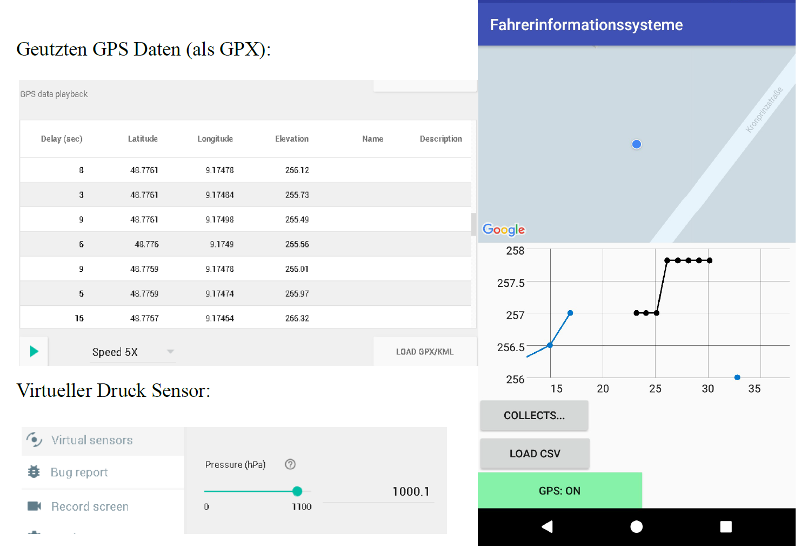

## Bachelor Study Project: Dead Reckoning Android App ##

The app was developed in Android Studio and is suitable for API Verison >21 but directly for
the API version 26.
The app contains a map which is provided by the Google
Maps API v2. On this map
current position and estimated route.
Underneath there is an altitude chart which shows the
for detected GPS locations the altitude and on the X-axis
the time of detection in real time.
Finally there is a rudimentary user input.
Buttons can be used to perform the following actions
execute:
- Collect and export CSV sensor data
export
- Import CSV files
- Turn GPS off/on to simulate a GPS failure
simulate

### Dead reckoning for altitude data: ###
If GPS data is available, the height information is entered into the diagram.
If the GPS fails (button) a HeightDR handler (class HeightDR) is started.
Functionality:
1. retrieve last known height & pressure information
2. start handler with clock rate 1Hz:
   1. calculate current pressure and pressure difference to initial value
   2. Apply barometric height pressure formula converted to deltaH
3. sum altitude difference with old altitude
4. enter new altitude into diagram (predicted altitude = color black, measured altitude (GPS) = color blue).
altitude (GPS) = color blue)